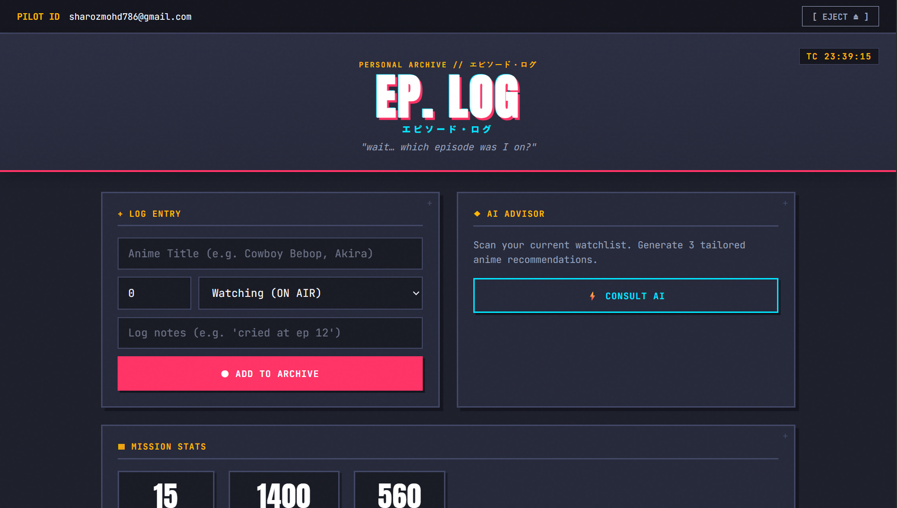

# Ep. Log

A tiny webapp for the eternal problem: *"wait... which episode was I on?"*

Track what you're watching, bump the episode counter with one click, and ask
an LLM (via Groq) for what to watch next based on your list.




---

## Why I built this

I watch a lot of anime and constantly lose track of which show and episode
I'm on. This is a small side project to fix exactly that — with a bit of fun
added on top: an LLM-powered "what should I watch next" recommendation based
on my current list.

## Tech stack

| Layer          | Tech                          |
|----------------|--------------------------------|
| Backend        | Flask (Python)                 |
| Frontend       | Vanilla HTML/CSS/JS            |
| Storage        | `data.json` (flat file, no DB) |
| Recommendations| Groq API (`openai/gpt-oss-120b`) |

## Features

- Add anime with title, current episode, status, and notes
- One-click **+1** to bump your episode count as you watch
- Delete entries you're done with (or embarrassed by)
- **Ask for a recommendation** — sends your watchlist to Groq and gets back
  3 picks with reasons, powered by an open-weight LLM running at Groq's
  LPU speeds

## Setup

```bash
git clone https://github.com/SHAROZ221/ep-log.git
cd ep-log
python -m venv venv
source venv/bin/activate   # on Windows: venv\Scripts\activate
pip install -r requirements.txt
cp .env.example .env
```

Open `.env` and paste your Groq API key:

```
GROQ_API_KEY=your_key_here
```

Get a free key at [console.groq.com/keys](https://console.groq.com/keys) —
no credit card required.

## Run it

```bash
python app.py
```

Open [http://127.0.0.1:5000](http://127.0.0.1:5000) in your browser.

## Project structure

```
ep-log/
├── app.py               # Flask backend — CRUD routes + Groq recommend endpoint
├── requirements.txt
├── .env.example
├── data.json             # your watchlist, stored locally
├── templates/
│   └── index.html
└── static/
    ├── style.css          # manga-panel inspired theme
    └── script.js
```

## Notes

- Data is stored locally in `data.json` — no database needed
- If you don't set a `GROQ_API_KEY`, everything still works except
  recommendations
- Built as a side project while pivoting toward GenAI/LLM application
  engineering — a small, complete example of wiring a Flask app to an
  LLM API end-to-end